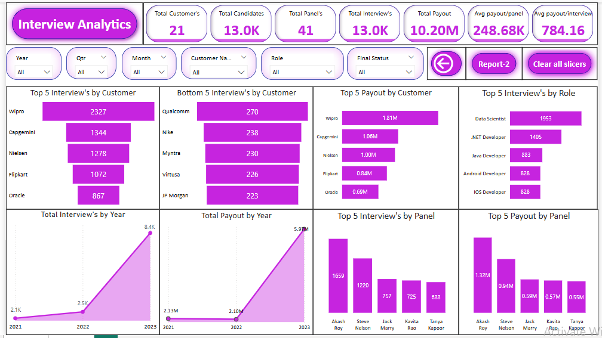
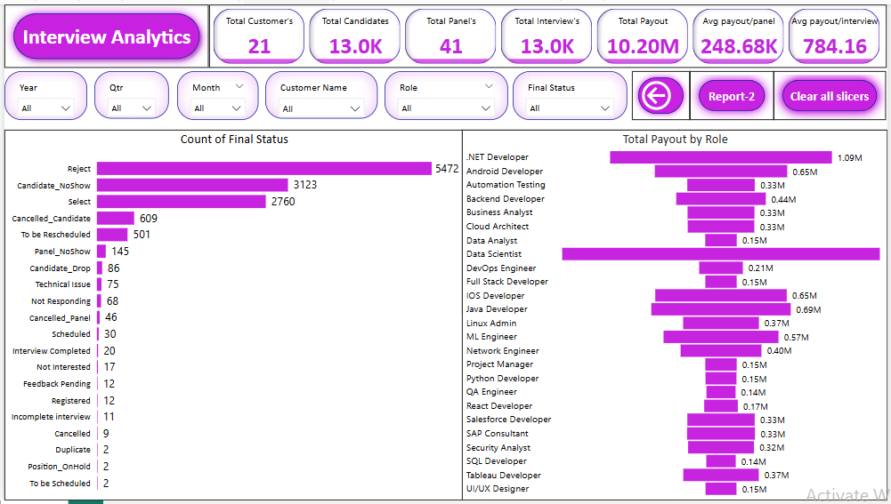

## 📊 Interview Analytics using SQL & Power BI

This project presents a comprehensive Interview Analytics Dashboard built using **SQL** for data preparation and **Power BI** for interactive visualizations. 
It helps recruitment teams and business leaders gain insights into interview trends, panel efficiency, customer performance, role-based payouts, and more.

### 🚀 Key Outcomes

- 🔍 Identify **top and bottom performing customers**
- 👥 Analyze **panel performance** and **interview distribution**
- 💰 Track **total payouts** by customer, role, and panel
- 📅 Visualize trends by **year**, **quarter**, **month**, and **day**
- 🎯 Assess **final status** outcomes like rejected, selected, or no-shows

### 🛠️ Tools & Technologies

| Tool      | Purpose                             |
|-----------|--------------------------------------|
| SQL (MySQL) | Data extraction, aggregation & KPIs |
| Power BI  | Dashboard creation & data visualization |
| DAX       | Calculated measures & dynamic titles |

### 📊 Dashboard Preview

#### 🔹 Overview Page

---

#### 🔹 Final Status & Role-wise Payout

### 🔹 Monthly Interview & Payout Trends

### 🔹 Daily Interview & Payout Trends

### 🔹 Quarterly Trends

### 🧮 **Main Metrics**
- **Total Customers**: 21
- **Total Candidates**: 13.0K
- **Total Panels**: 41
- **Total Interviews**: 13.0K
- **Total Payout**: ₹10.20M
- **Avg Payout per Panel**: ₹248.68K
- **Avg Payout per Interview**: ₹784.16

### 📈 **Key Visuals & KPIs**

- **Top 5 Interviews by Customer** (e.g., Wipro, Capgemini, Nielsen)
- **Bottom 5 Interviews by Customer** (e.g., Qualcomm, JP Morgan)
- **Top 5 Payout by Customer**
- **Top 5 Interviewed Roles** (Data Scientist, .NET Developer)
- **Year-wise Interview Trend**
- **Year-wise Payout Trend**
- **Top 5 Interviewers by Panel**
- **Payout by Panel**
- **Final Interview Status Breakdown**
- **Role-wise Payout Distribution**

### 📅 **Time-Based Visuals**

| View                | KPI Examples                     |
|---------------------|----------------------------------|
| **By Year**         | Interviews & Payout growth (2021–2023) |
| **By Quarter**      | Declining trend Q2 → Q4          |
| **By Month**        | Monthly drops from April to October |
| **By Day**          | Daily fluctuations in interviews and payouts |

---

### 📌 Final Status Breakdown (Top 5)

| Status             | Count  |
|--------------------|--------|
| Reject             | 5,472  |
| Candidate No-Show  | 3,123  |
| Selected           | 2,760  |
| Cancelled          | 609    |
| To Be Rescheduled  | 501    |

### 💼 Use Cases

- Customer and panel performance evaluation
- Identify high-ROI customers and roles
- Understand reasons for interview drops or rejections
- Optimize resource allocation by time-based trends

### 🧠 SQL KPIs Generated

- Interview count by year/month/quarter/day
- Panel payout by customer and role
- Final status breakdowns
- Top/Bottom N filters using `DENSE_RANK()`

### 📬 Author

**Syed Jakeer Hussin**  

### 📎 License

This project is for educational and demonstration purposes only.  
All data used is fictional or anonymized.

